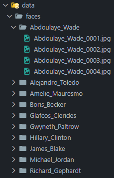
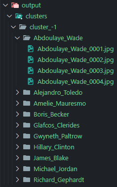

# FaceClustering

## Descrição do Projeto

Este projeto realiza o agrupamento de imagens de rostos por semelhança usando **Deep Learning** e **Clustering**. Ele processa um conjunto de imagens, extrai características faciais usando uma rede neural ResNet pré-treinada e agrupa as imagens com base na similaridade dos rostos, utilizando o algoritmo **DBSCAN** do `scikit-learn`.

## Estrutura do Projeto


## Configuração e Instalação

### 1. Configurar o Ambiente de Desenvolvimento

Certifique-se de que o `Python 3.11.0` está instalado e crie um ambiente virtual:

```bash
python -m venv venv
```

Ative o ambiente virtual:

- **Windows:**

```bash
venv\Scripts\activate
```

- **Linux/MacOS:**

```bash
source venv/bin/activate
```

### 2. Instalar as Dependências

Instale as bibliotecas necessárias listadas no `requirements.txt`:

```bash
pip install -r requirements.txt
```

Certifique-se de que o `torch` e o `torchvision` estão instalados e atualizados. Se houver problemas ao instalar o `torch`, consulte o [site oficial do PyTorch](https://pytorch.org/) para instruções específicas.

## Como Executar o Projeto

1. Coloque seu dataset de rostos na pasta `data/faces`, organizado em subpastas, onde cada subpasta representa um grupo de imagens de uma mesma pessoa. A estrutura deverá ser assim:



2. Execute o script `main.py` para realizar o agrupamento:

```bash
python main.py
```

3. O resultado será salvo na pasta `output/clusters`. O cluster será salvo em uma pasta separada e rotulada com base na similaridade dos rostos, por exemplo, `cluster_-1`.

## Exemplos de Saída

Cada pasta `cluster_<label>` conterá imagens que foram agrupadas com base na similaridade dos rostos. A estrutura da saída será:


